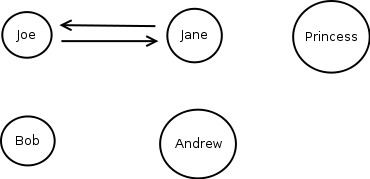
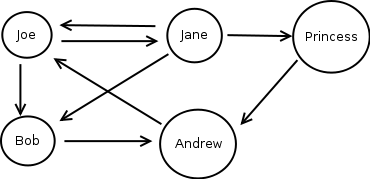

!SLIDE

# Distributed Version Control System #
## (DVCS) ##

!SLIDE bullets incremental

* Mercurial (hg)
* Bazaar (bzr)
* Darcs
* Monotone

!SLIDE bullets

* <strike>Mercurial (hg)</strike>
* <strike>Bazaar (bzr)</strike>
* <strike>Darcs</strike>
* <strike>Monotone</strike>

!SLIDE bullets

* <strike>Mercurial (hg)</strike>
* <strike>Bazaar (bzr)</strike>
* <strike>Darcs</strike>
* <strike>Monotone</strike>
*  

!SLIDE center

!SLIDE center

!SLIDE center

!SLIDE center

!SLIDE center

!SLIDE center

!SLIDE center

!SLIDE commandline

	┌─[pearson@Bragi] - [~/Documents/talk-revision_control] - [Tue Jan 26, 06:38]
	└─[$]> git add -p showoff.json 
	diff --git a/showoff.json b/showoff.json
	index 6a561f0..f58d37d 100644
	--- a/showoff.json
	+++ b/showoff.json
	@@ -1,5 +1,6 @@
	 [
	-       {"section": "intro"},
	-       {"section": "why"},
	-       {"section": "how"}
	+       //{"section": "intro"},
	+       //{"section": "why"},
	+       //{"section": "how"},
	+       {"section": "git"}
	 ]
	Stage this hunk [y,n,q,a,d,/,e,?]?

!SLIDE

# http://tomayko.com/writings/the-thing-about-git #
