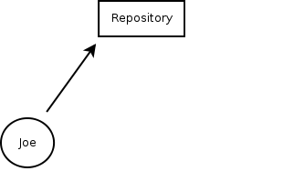
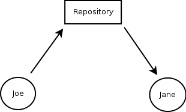
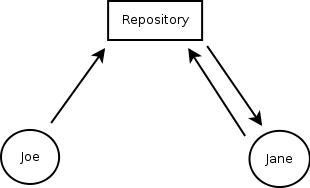
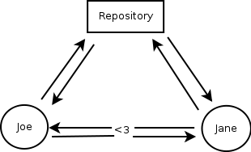

!SLIDE

# How Does Version Control Work? #

!SLIDE bullets incremental

* Repository: the database of files
* Server: the computer hosting the repository
* Client: a computer accessing the repository
* Diff: the changes between two text files
* Commit: send a diff to the repository

!SLIDE center

# Basic Process #

!SLIDE center

# Basic Process #

!SLIDE center

# Basic Process #

!SLIDE center

# Basic Process #

!SLIDE center

# Basic Process #

!SLIDE

# CVS #

!SLIDE

# <strike>CVS</strike> #

!SLIDE

# Subversion (svn) #
## http://svnbook.red-bean.com/ ##
